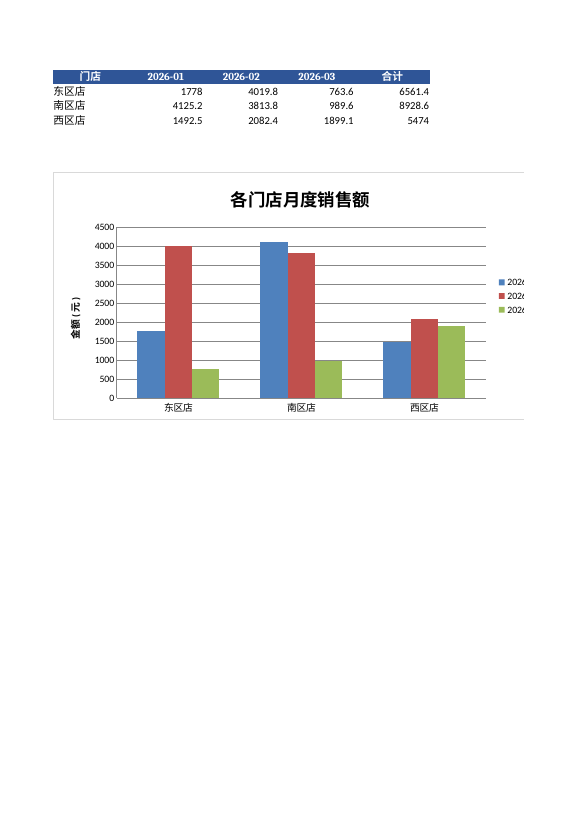

# Excel 多表合并清洗 + 自动汇总报表

## 解决什么问题
每个门店/部门各交一份 Excel，格式差不多但有重复行、空值、多余空格，每月手工复制粘贴、做透视表、画图很耗时间。这个脚本一键完成。

## 功能
- 合并目录下所有 `.xlsx`，自动加"门店"列（取文件名）
- 清洗：去除商品名首尾空格、删除重复行、删除缺失数量的行
- 输出报表：门店×月份汇总（含合计）、商品汇总、清洗后明细、清洗日志，表头美化 + 柱状图

## 用法
```bash
pip install -r requirements.txt
python make_sample.py                    # 生成 3 份虚构门店销售表
python merge_report.py                   # 默认读 sample_input/，输出 output/销售汇总报表.xlsx
python merge_report.py 我的目录 output/结果.xlsx
```

## 示例输出
输入：`sample_input/` 下 3 个表，共 99 行原始数据。清洗日志：删除重复 9 行、缺失数量 29 行，有效 61 行。


