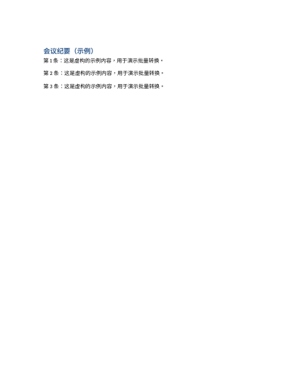

# 批量 Word 转 PDF / PDF 合并拆分

## 解决什么问题
几十份 Word 要逐个"另存为 PDF"，再把它们合成一个文件提交，或把一个大 PDF 按页拆开发给不同的人。

## 用法
```bash
pip install -r requirements.txt
python make_sample.py                         # 生成 3 份虚构 Word
python pdf_tools.py demo                      # 转换 → 合并 → 拆分 全流程
python pdf_tools.py convert docx目录 输出目录
python pdf_tools.py merge 输出.pdf a.pdf b.pdf
python pdf_tools.py split 输入.pdf 输出目录
```
Word 转 PDF 依赖 LibreOffice（Linux/Mac）；Windows 上装了 Word 的话可以 `pip install docx2pdf`，脚本会自动改用它。合并、拆分只用 pypdf。

## 示例输出
- `output/pdf/`：3 份 Word 转出的 PDF
- `output/合并结果.pdf`：合并后共 4 页
- `output/拆分结果/`：按页拆成 4 个文件


