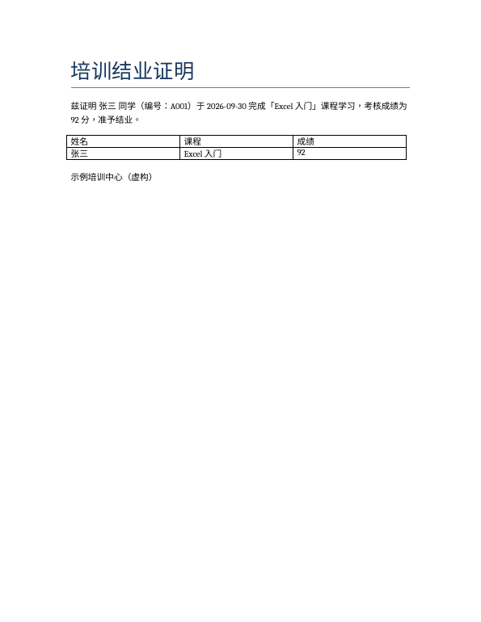

# 按模板批量生成 Word 文档

## 解决什么问题
结业证书、录用通知、合同、邀请函……内容格式一样，只有姓名、编号、日期不同。手工改上百份容易出错。

## 用法
1. 在 Word 模板里写 `{{列名}}` 占位符（正文和表格里都可以）
2. Excel 名单的列名和占位符对应
```bash
pip install -r requirements.txt
python make_sample.py          # 生成虚构模板和 5 人名单
python batch_generate.py       # 输出到 output/
python batch_generate.py 模板.docx 名单.xlsx 输出目录
```

## 前后对比
- 模板：`sample_input/模板_结业证明.docx`（含 `{{姓名}}` `{{课程}}` 等）
- 生成：`output/A001_张三_结业证明.docx` 等 5 份



注：同一段落内的占位符替换后沿用该段第一处文字的格式。
